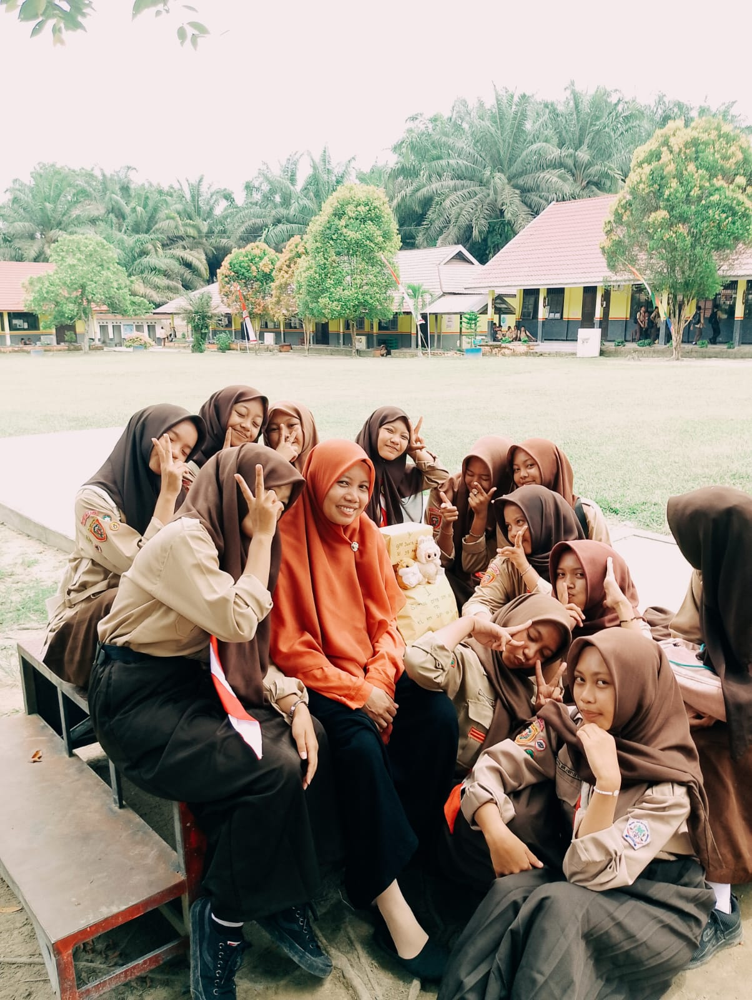
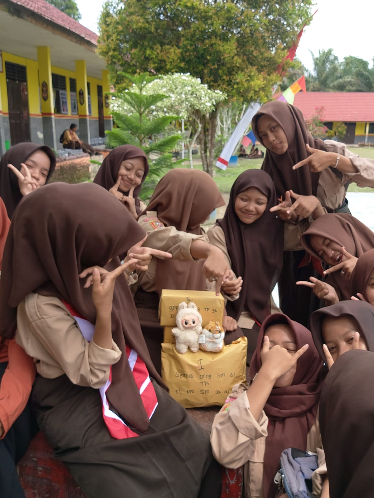
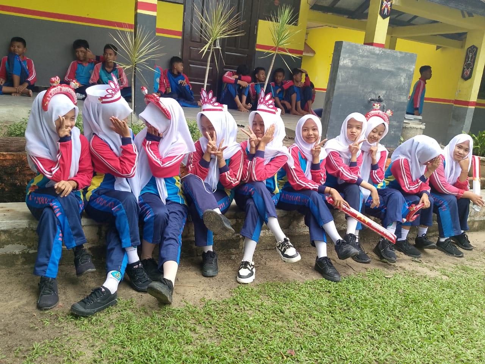
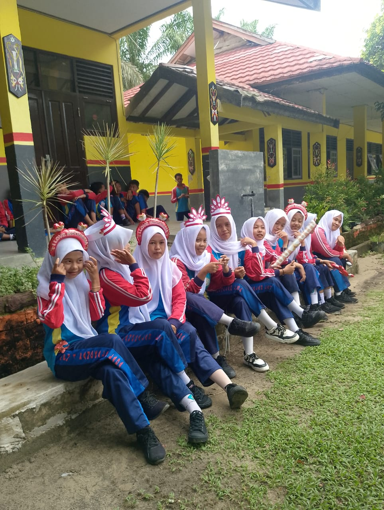

  
<head>
  <meta charset="UTF-8">
  <title>Website Kelas IX-B</title>
  
</head>
<body>
<header>
  <h1>SMPN 1 PANGKALAN LADA</h1>
  <h2>Website Kelas IXB</h2>
  <html lang="id">
<head>
  <meta charset="UTF-8">
  <title>Tanggal & Waktu</title>
  
</head>
<body>
  

  
</body>
</html>
</header>
<nav>
  <button class="menu-btn" onclick="showContent('pesan')">Tulis Pesan</button>
  <button class="menu-btn" onclick="showContent('struktur')">Struktur Kelas</button>
  <button class="menu-btn" onclick="showContent('anggota')">Anggota Siswa</button>
  <button class="menu-btn" onclick="showContent('tata')">Tata Tertib Kelas</button>
  <button class="menu-btn" onclick="showContent('kebersihan')">Peraturan Kebersihan</button>
  <button class="menu-btn" onclick="showContent('pelajaran')">Jadwal Pelajaran</button>
  <button class="menu-btn" onclick="showContent('piket')">Jadwal Piket</button>
  <button class="menu-btn" onclick="showContent('pr')">Tugas / PR</button>
  <button class="menu-btn" onclick="showContent('galeri')">Galeri Foto</button>
</nav>

  <h2>Selamat datang di Website Kelas IX-B!</h2>
  
Klik di atas untuk melihat informasi penting dan seru seputar kelas kita 😊

<footer>
  
Website Kelas IXB | Designed by: APutraN

  

    <!-- Tambahkan link Font Awesome di bagian <head> -->
<link rel="stylesheet" href="https://cdnjs.cloudflare.com/ajax/libs/font-awesome/6.4.0/css/all.min.css">
        <a href="https://www.instagram.com/ofc.songobhee9?igsh=MTFmeTdrazB1dXd5NA" target="_blank" style="margin: 0 10px; text-decoration: none; color: #E1306C;">
            <i class="fab fa-instagram"></i> Instagram
        </a>
        <a href="https://www.tiktok.com/@asixxbee6?_t=ZS-8xULIQm8QXR&_r=1" target="_blank" style="margin: 0 10px; text-decoration: none; color: #000;">
            <i class="fab fa-tiktok"></i> TikTok
        </a>
    

</footer>

</body>
